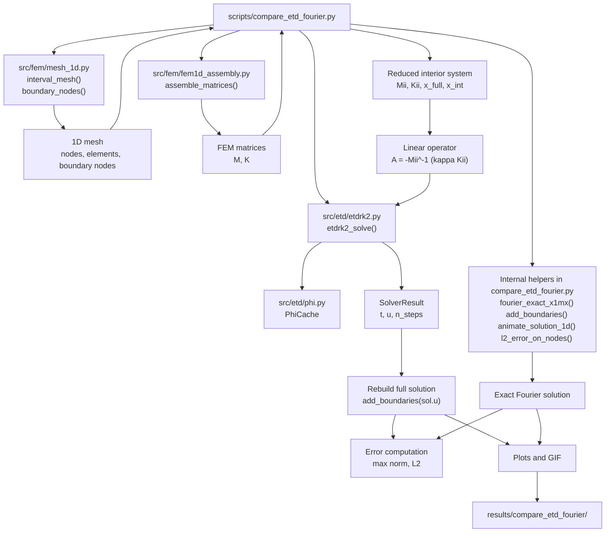

```mermaid
flowchart
    A["scripts/compare_etd_fourier.py"] --> B["src/fem/mesh_1d.py
    interval_mesh()
    boundary_nodes()"]

    A --> C["src/fem/fem1d_assembly.py
    assemble_matrices()"]

    A --> D["src/etd/etdrk2.py
    etdrk2_solve()"]

    D --> E["src/etd/phi.py
    PhiCache"]

    A --> F["Internal helpers in compare_etd_fourier.py
    fourier_exact_x1mx()
    add_boundaries()
    animate_solution_1d()
    l2_error_on_nodes()"]

    B --> G["1D mesh
    nodes, elements, boundary nodes"]

    C --> H["FEM matrices
    M, K"]

    G --> A
    H --> A

    A --> I["Reduced interior system
    Mii, Kii, x_full, x_int"]

    I --> J["Linear operator
    A = -Mii^-1 (kappa Kii)"]

    J --> D
    F --> K["Exact Fourier solution"]
    D --> L["SolverResult
    t, u, n_steps"]

    L --> M["Rebuild full solution
    add_boundaries(sol.u)"]

    M --> N["Error computation
    max norm, L2"]
    K --> N

    M --> O["Plots and GIF"]
    K --> O

    O --> P["results/compare_etd_fourier/"]

```
